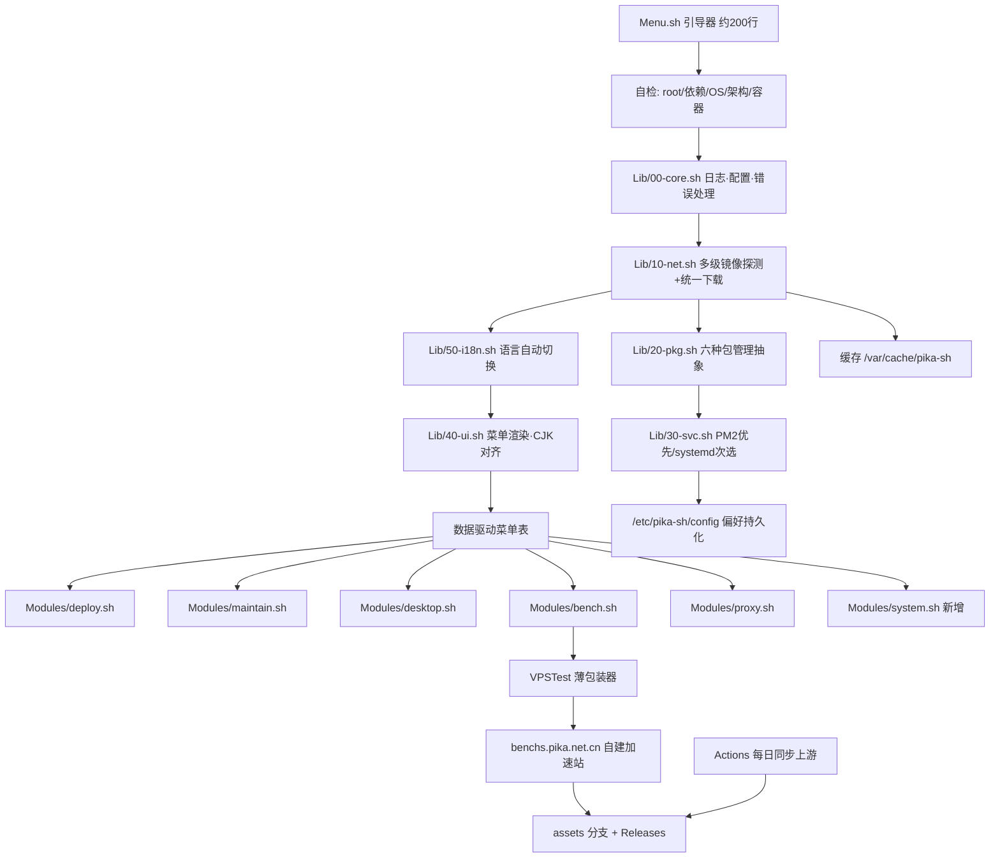
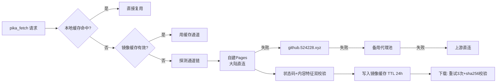

## 用户需求

对 CloudScripts（PIKA SH 服务器脚本工具箱）执行一次系统性修复与重构，目标是把当前"看起来功能很多、实际大量跑不通"的项目改造成真正开箱即用、在纯中国大陆网络环境下也能顺畅使用的工具箱。

## 产品概述

一个通过一行命令启动的服务器运维工具箱，自动识别系统环境、自动补齐依赖、自动选择最快的下载通道，提供部署、维护、桌面安装、性能测评、代理配置五大类功能，支持中英双语自动切换。

## 核心功能

### 1. 致命缺陷修复

- 修复桌面环境安装：当前 6 个可选桌面中有 5 个启动即失败，需让所有桌面脚本在远程执行场景下都能正常加载公共库
- 修复桌面安装状态标记冲突（两个桌面共用同一标记值，导致重复安装保护失效）
- 修复远程桌面中转服务的服务描述文件语法错误（当前完全无法启动）
- 修复图形栈脚本的服务抑制文件写入错误（内容与权限均不正确）
- 修复高性能内核安装：增加处理器指令集检测，避免装上不兼容内核导致无法启动

### 2. 全局大陆网络加速（硬性要求）

- 建立多级下载通道回退链：自建加速站点 → 加速代理 → 备用代理池 → 上游直连
- 通道探测需校验响应状态与内容特征，避免被劫持的假响应误判为可用
- 探测结果本地缓存复用，避免每次启动重复探测
- 支持用户通过参数或环境变量强制指定通道
- 全项目统一走同一套下载入口，消除当前四套地址各自为政、十余处功能绕过加速直连的问题

### 3. 测评脚本远程化

- 将仓库内约 435 MB 的本地测评脚本与二进制资产全部迁出主仓库
- 15 个测评入口改为运行时按需下载的轻量包装器
- 迁出的资产由自动化流程每日从上游同步，并发布到大陆可直连的自建站点，保证远程化后依然可用
- 下载支持断点复用、失败重试与完整性校验

### 4. 一致性治理

- 统一服务托管方式：优先使用 PM2 托管，其次使用系统服务，无系统服务环境自动降级
- 提供交互式选择并记住用户偏好，也支持参数指定
- 将现存三套并行的托管方式（PM2、系统服务、容器自启）收敛到统一接口，提供统一的启停、状态查看、日志查看、卸载能力

### 5. 依赖自动安装与傻瓜化

- 统一多发行版包管理抽象，覆盖主流六种包管理器
- 首次运行自动补齐基础工具，缺失命令时自动安装
- 按需自动安装运行时环境（含国内镜像加速）
- 消除当前失败被静默忽略导致"假成功"的问题，改为显式报错并给出处置建议
- 增加权限检查、环境自检并在首屏展示系统与通道状态

### 6. 深度模块化

- 主入口瘦身为轻量引导器，业务功能拆分为按需下载的独立模块并本地缓存
- 菜单改为数据驱动，新增功能只需增加一条配置
- 消除重复实现（同一功能两处不同实现）与重复代码块（七份几乎相同的前置检查）
- 支持命令行直达（如直接指定分类与子项一键执行）与帮助信息

### 7. 多语言支持

- 中英双语，按系统语言环境自动切换
- 支持手动切换并持久化
- 新增语言只需放入语言包文件，无需改动业务代码
- 缺失词条自动回退，避免显示空白

### 8. 安全与健壮性加固

- 默认口令改为随机生成、不回显
- 系统参数与挂载配置改为幂等写入，避免重复执行累积垃圾配置
- 修正已废弃的密钥导入方式
- 补齐新版系统的换源支持
- 危险操作增加二次确认与容器环境检测

### 9. 功能补齐与文档修订

- 新增常用能力：安全加固、时区校时、系统信息速览、脚本自更新与快捷命令、卸载回滚
- 修正文档中与实际实现不符的编号体系、功能描述、前置要求
- 新增大陆加速说明、服务托管说明、多语言扩展说明、第三方来源与许可声明

## 技术栈

沿用项目现有技术栈，不引入新语言或运行时：

- **主体语言**：Bash 4+（主菜单与模块），`Linux/Desktop/commons.sh` 保持 POSIX `sh` 兼容以适配 Alpine
- **服务托管**：PM2（优先）+ systemd（次选）+ nohup/`/run.sh`（容器降级）
- **包管理抽象**：apt / dnf / yum / apk / pacman / zypper
- **分发与加速**：GitHub Pages（现有 `gh-bat.pika.net.cn`、`gh-vps.pika.net.cn`）+ GitHub Releases（大文件）+ GitHub Actions（每日同步上游）
- **静态检查**：shellcheck（GitHub Actions）
- **文档**：VitePress（沿用 `docs/`）

## 关键现状核实（本次探索确认）

| 事实 | 值 |
| --- | --- |
| `Menu.sh` 实际行数 | **1075 行**（结尾 `main "$@"` 在第 1074-1075 行） |
| `Linux/VPSTest/ip-quality.sh` | 2603 行、109,172 字节（内联完整第三方脚本） |
| `VPSTest` 12 个子目录总体积 | **约 435 MB**，`ecss-bench/` 单目录 360.28 MB / 97 文件 |
| `benchs.pika.net.cn` 引用 | 遍布 **27 个文件**、约 150 处，是二进制与脚本资产的实际来源 |
| 根 `CNAME` | `gh-bat.pika.net.cn` |
| `Linux/VPSTest/CNAME` | `gh-vps.pika.net.cn` |
| `.github/workflows` | **不存在**，需新建 |
| 服务托管现状 | EasyTier 用 PM2（`Menu.sh:464-465`）、Aria2 用 systemd（`Menu.sh:648-674`）、wg-easy 用 `docker run --restart=always`（`Menu.sh:369-383`） |
| 依赖安装散落 | `Menu.sh` 中 14 处 `apt install` / `yum install`，多数被 `2>/dev/null \ | \ | true` 吞掉 |
| `commons.sh` | POSIX `sh`，已具备 debian/ubuntu/fedora/arch/alpine 的 `PKG_UPDATE`/`PKG_INSTALL` 抽象，可作为扩展基础 |


## 实现策略

### 核心决策一：把 `benchs.pika.net.cn` 转正为"大陆加速主通道"

这是满足"纯大陆网络也能下载"的关键。当前该域名已在服务，但其内容来源就是主仓库里的 435 MB vendored 目录——直接删除会导致加速站失效。因此采用**资产迁移而非删除**：

1. 新建 `assets` 孤立分支（`git switch --orphan assets`），承载全部测评脚本快照与二进制
2. GitHub Actions 每日从各上游拉取最新脚本 → 提交到 `assets` 分支 → 部署 Pages 到 `benchs.pika.net.cn`
3. 超过 100 MB 的大二进制（`ecss-bench/` 内的 `*.tgz`、无扩展名二进制）改走 GitHub Releases 附件，由 Actions 上传
4. `main` 分支 `git rm -r` 移除 vendored 目录（保留 `.gitattributes` 说明），主仓库体积回归轻量

**权衡**：不做 `git filter-repo` 清理历史（避免破坏已有 clone 与 Pages 部署链），仅停止新增。历史体积可后续单独处理。

### 核心决策二：多级通道回退 + 抗污染探测

大陆网络的真实困难不是"慢"，而是**被劫持后返回假响应**。因此探测必须校验内容特征而非仅看 curl 退出码：

```
# Linux/Lib/10-net.sh
PIKA_MIRRORS=(
    "${PIKA_MIRROR}"                          # 用户强制指定，最高优先
    "https://benchs.pika.net.cn"              # 自建 Pages，大陆直连（资产）
    "https://gh-vps.pika.net.cn"              # 自建 Pages 备用
    "https://gh-bat.pika.net.cn"              # 自建 Pages（脚本）
    "https://github.524228.xyz/https://raw.githubusercontent.com/PIKACHUIM/CloudScripts/main"
    "https://ghfast.top/https://raw.githubusercontent.com/PIKACHUIM/CloudScripts/main"
    "https://gh-proxy.com/https://raw.githubusercontent.com/PIKACHUIM/CloudScripts/main"
    "https://raw.githubusercontent.com/PIKACHUIM/CloudScripts/main"
)

# 探测：HTTP 状态码 + 内容特征双校验，规避 DNS 污染返回的伪页面
_probe_mirror() {
    local base="$1" code
    code=$(curl -fsS -o /tmp/.pika_probe -w '%{http_code}' \
           --connect-timeout 3 --max-time 6 "${base}/.pika-healthz" 2>/dev/null) || return 1
    [ "$code" = "200" ] && grep -q 'PIKA_SH_OK' /tmp/.pika_probe
}
```

- 每个可用通道根部署一个 `.pika-healthz` 探针文件（内容含 `PIKA_SH_OK` 特征串 + 版本号）
- 探测结果写入 `/var/cache/pika-sh/mirror.conf`，TTL 24h，避免每次启动重复探测
- `pika_fetch()` 统一下载：`curl -fL` 优先、`wget` 回退、3 次重试、可选 sha256 校验、命中本地缓存直接复用
- `gh_url()` 把任意 GitHub 地址改写为当选代理，供第三方脚本（Hysteria2/SS/Trojan/BBRPlus/DD 重装等 12 处）统一使用

**复杂度**：首次启动探测为 O(n) 串行短超时（最坏约 6s×失败数），命中缓存后为 O(1)。为控制最坏耗时，采用"前 3 个通道并发探测、取最先成功者"的策略。

### 核心决策三：服务托管抽象（PM2 优先 / systemd 次选 / 用户可选）

```
# Linux/Lib/30-svc.sh
# 后端选择：显式参数 > 持久化配置 > 自动探测
svc_detect_backend() {
    case "${PIKA_SVC_BACKEND:-auto}" in
        pm2|systemd|nohup) echo "$PIKA_SVC_BACKEND"; return ;;
    esac
    command -v pm2 >/dev/null 2>&1 && { echo pm2; return; }
    [ -d /run/systemd/system ] && { echo systemd; return; }   # 容器内该目录不存在
    command -v node >/dev/null 2>&1 && { echo pm2; return; }
    echo nohup
}

# 统一注册接口，屏蔽后端差异
svc_register() {   # --name X --exec "cmd args" --workdir D --env K=V --autostart
    case "$(svc_backend)" in
        pm2)     ensure_pm2 && pm2 delete "$name" 2>/dev/null; pm2 start ... && pm2 save ;;
        systemd) _write_unit_strict "$name" ... ; systemctl daemon-reload; systemctl enable --now "$name" ;;
        nohup)   run_append "nohup $exec >> /var/log/${name}.log 2>&1 &" ;;
    esac
}
svc_start / svc_stop / svc_restart / svc_status / svc_logs / svc_remove / svc_list
```

- 首次涉及服务安装时弹出一次性选择（PM2 / systemd / 自动），写入 `/etc/pika-sh/config`
- `_write_unit_strict()` 生成**每指令独占一行**的 unit，彻底修复 RustDesk 的 `;` 分隔符问题
- 迁移目标：EasyTier、FRP Panel（现 PM2）、Aria2（现 systemd）、RustDesk（现损坏 unit）、3X-UI；wg-easy 保持容器部署但纳入 `svc_list` 统一状态视图
- 容器/LXC/WSL 无 `/run/systemd/system` 时自动降级，不再出现 `systemctl` 静默失败

### 核心决策四：依赖自动安装（傻瓜化）

```
# Linux/Lib/20-pkg.sh
pkg_detect()        # 输出 apt|dnf|yum|apk|pacman|zypper
pkg_map()           # 跨发行版包名映射（python3-pip / py3-pip、iproute2 / iproute 等）
pkg_update_once()   # 全局幂等，用 /run/.pika-pkg-updated 标记，避免重复 update
pkg_install()       # 显式返回码，失败打印发行版专属提示，不再 || true
ensure_cmd()        # ensure_cmd curl jq tar → 缺失自动装，装不上明确报错
bootstrap_deps()    # 启动自检：curl wget tar unzip jq ca-certificates
ensure_node_pm2()   # 按需装 Node LTS + PM2，走 npmmirror / NVM_NODEJS_ORG_MIRROR
```

顺带解决 `Menu.sh:63-82` 的 `_str_w()` 四级回退问题：`bootstrap_deps` 保证 `python3` 或提供纯 bash 的 CJK 宽度兜底实现，去掉对 perl/sed 的脆弱依赖。

### 核心决策五：数据驱动菜单 + 模块按需下载

`Menu.sh` 从 1075 行降为约 200 行引导器，只做：自检 → 加载核心库 → 渲染菜单 → 分派。业务功能下沉到 `Linux/Modules/*.sh`，用户点进某分类才下载对应模块并缓存到 `/var/cache/pika-sh/modules/`。

```
# 菜单表：key|标题i18n键|描述i18n键|处理函数
MENU_DEPLOY=(
  "1|deploy.mirror|deploy.mirror.desc|do_switch_mirror"
  "4|deploy.docker|deploy.docker.desc|do_install_docker"
)
render_menu()  { local -n a=$1; ... print_item "$k" "$(t "$title")" "$(t "$desc")"; }
dispatch()     { local -n a=$1; ... "$fn"; }   # 失败显式报错并停留，不再静默 break
```

同时实现文档已宣传但未落地的传参直达：`Menu.sh 4 1`、`--lang=en`、`--mirror=URL`、`--backend=systemd`、`--yes`、`--help`。

### 核心决策六：i18n（自动切换 + 可扩展）

```
# Linux/Lib/50-i18n.sh
declare -A T
i18n_detect()  # PIKA_LANG > /etc/pika-sh/config > LC_ALL > LC_MESSAGES > LANG > zh_CN
i18n_load()    # 先载 zh_CN 兜底，再用目标语言覆盖 → 缺词自动回退不留空
t()            # t key [printf 参数...]
```

新增语言只需投放 `Linux/I18n/<locale>.sh`，`i18n_detect` 按 `${LANG%%.*}` 探测同名文件存在性即自动生效，无需改业务代码。菜单增加"切换语言"项并持久化。

## 架构设计



下载通道决策流：



## 目录结构

```
CloudScripts/
├── Menu.sh                                  # [MODIFY] 1075行 → 约200行引导器；自检/加载核心库/数据驱动菜单/传参解析(--help --lang --mirror --backend --yes)/直达执行；修复无root检查、失败静默break、macOS直接拒绝
├── CNAME                                    # [KEEP] gh-bat.pika.net.cn
├── .pika-healthz                            # [NEW] 通道探针文件，内容含 PIKA_SH_OK + 版本号，供 _probe_mirror 做内容特征校验
├── THIRD_PARTY_NOTICES.md                   # [NEW] 逐条登记 ecs.sh(spiritLHLS)/yabs(Mason Rowe,MIT)/superbench(Oldking)/unixbench(Teddysun)/prettyping 等上游地址·作者·许可，消除合规风险
├── .github/workflows/
│   ├── mirror-sync.yml                      # [NEW] 每日定时从各上游拉取测评脚本最新版 → 提交到 assets 分支；大二进制上传到 Releases；失败发 issue 告警
│   ├── pages-deploy.yml                     # [NEW] 部署 assets 分支到 benchs.pika.net.cn / gh-vps.pika.net.cn；同时在各站点根生成 .pika-healthz
│   └── shellcheck.yml                       # [NEW] 对全部 *.sh 跑 shellcheck；校验 zh_CN/en_US 语言包键集合一致性
├── Linux/
│   ├── Lib/                                 # [NEW] 公共库（运行时下载并缓存）
│   │   ├── 00-core.sh                       #   日志分级(pika_info/warn/err)、错误处理(不再静默吞错)、配置读写(/etc/pika-sh/config)、root与容器检测、幂等写入助手(sysctl drop-in/fstab去重)、危险操作二次确认
│   │   ├── 10-net.sh                        #   PIKA_MIRRORS 通道链、_probe_mirror 抗污染探测(状态码+内容特征)、镜像缓存(TTL 24h)、pika_fetch(重试3次/sha256/缓存复用)、gh_url 改写、pika_run_remote(落盘执行不抢占stdin)
│   │   ├── 20-pkg.sh                        #   pkg_detect(六种包管理器)、pkg_map(跨发行版包名映射)、pkg_update_once(幂等)、pkg_install(显式失败)、ensure_cmd、bootstrap_deps、ensure_node_pm2(npmmirror)
│   │   ├── 30-svc.sh                        #   svc_detect_backend(PM2优先/systemd次选/nohup降级)、svc_choose_backend(交互+持久化)、svc_register/start/stop/restart/status/logs/remove/list、_write_unit_strict(每指令独占一行)
│   │   ├── 40-ui.sh                         #   颜色、print_header/item/section、CJK宽度对齐(去掉perl/sed脆弱回退)、render_menu、dispatch(失败显式报错并停留)、confirm_install
│   │   └── 50-i18n.sh                       #   i18n_detect(PIKA_LANG>config>LC_ALL>LC_MESSAGES>LANG)、i18n_load(zh_CN兜底+目标覆盖)、t() 取词与printf占位
│   ├── I18n/
│   │   ├── zh_CN.sh                         # [NEW] 中文语言包，全量词条（兜底语言，键最全）
│   │   └── en_US.sh                         # [NEW] 英文语言包，键与 zh_CN 对齐，由 CI 校验无缺失
│   ├── Modules/                             # [NEW] 业务模块，按需下载并缓存
│   │   ├── deploy.sh                        #   换源(补 Ubuntu 24.04 deb822 ubuntu.sources)、Docker(走加速)、Podman、1Panel、宝塔(改官方参数化，弃用喂序号)、NetPanel、哪吒、Node+PM2、EasyTier/FRP/RustDesk/ZeroTier/Tailscale 全部改走 svc_register
│   │   ├── maintain.sh                      #   清理(多发行版)、Swap(fstab去重幂等)、BBR/TCP(改写 /etc/sysctl.d/99-pika-*.conf 覆盖式)、BBRPlus(走gh_url)、UFW、Fail2ban(补 backend=systemd)、屏蔽地区、限速(端口数量上限保护+持久化)、内核(XanMod 增加 x86-64-v1~v4 检测)、DD重装(容器环境检测+走gh_url)
│   │   ├── desktop.sh                       #   桌面调度；集中维护 flag 值表；调用远程 DE 脚本改用 pika_run_remote 落盘执行；补入 Hyprland/Niri 两个此前不可达的桌面
│   │   ├── bench.sh                         #   13 项测评调度，统一通过 pika_bench_run 多源回退执行 VPSTest 薄包装器
│   │   ├── proxy.sh                         #   3X-UI(消除与 Tunnels/3x-ui 的双份实现，统一为一处)、Clash、Hysteria2、SS-rust、Trojan-Go、WARP/WGCF、WireGuard、wg-easy(改 ghcr.io/wg-easy/wg-easy + PASSWORD_HASH，口令随机不回显)；全部改走 gh_url
│   │   └── system.sh                        # [NEW] SSH加固(改端口/禁root密码登录/导入公钥)、时区与NTP、系统信息速览、脚本自更新、快捷命令 p 软链、卸载与回滚入口
│   ├── VPSTest/                             # [MODIFY] 远程化改造
│   │   ├── ecss-bench.sh                    #   225,810字节 → 约20行薄包装器，多源回退拉取上游 ecs.sh 后执行
│   │   ├── ip-quality.sh                    #   2603行/109,172字节 → 薄包装器
│   │   ├── lemonbench.sh                    #   109,777字节 → 薄包装器
│   │   ├── yabs-bench.sh                    #   49,293字节 → 薄包装器
│   │   ├── prettyping.sh                    #   24,623字节 → 薄包装器
│   │   ├── superspeed.sh                    #   22,681字节 → 薄包装器
│   │   ├── superbench.sh                    #   19,239字节 → 薄包装器；顺带修复其检测 /usr/bin/python(python2) 在 Debian12/Ubuntu24 必然失败的问题
│   │   ├── qsyb-bench.sh                    #   14,299字节 → 薄包装器
│   │   ├── supertrace.sh / mping-test.sh / unix-bench.sh / back-trace.sh / best-trace.sh
│   │   │                                    #   统一薄包装器；资产地址由 pika_fetch 多源解析，不再硬编码 benchs.pika.net.cn
│   │   ├── ecss-bench/ 等 12 个子目录        # [DELETE] 约 435 MB（ecss-bench 360.28MB/97文件、best-trace 17.25MB、yabs-bench 17.24MB、supertrace 16.04MB、mping-test 8.49MB、lemonbench 8.31MB、back-trace 4.61MB、ip-quality 2.22MB、superbench 1.97MB、qsyb-bench 1.06MB、unix-bench 0.14MB、superspeed 空）→ 迁往 assets 分支 + Releases
│   │   ├── index.html                        # [DELETE] 84,659字节 Pages 残留
│   │   ├── speed-test.py                     # [DELETE] 65,334字节，未被任何菜单引用的死代码
│   │   └── CNAME                             # [DELETE] 子目录 CNAME 对 GitHub Pages 无效，属误导；域名改由 pages-deploy.yml 统一管理
│   ├── Desktop/
│   │   ├── commons.sh                        # [MODIFY] 保持 POSIX sh；新增 de_precheck/de_finish 公共前置检查（替换 7 份重复块）、集中 flag 值常量表、修正 policy-rc.d 写法；扩展 zypper 支持
│   │   ├── LXC-Debian-Graphy.sh              # [MODIFY] 修复第18行 echo 缺 -e 导致写入字面 \n 且未 chmod +x 的 policy-rc.d 问题；NoMachine 版本改为动态解析 + ARM 支持；移除后台拉起 /sbin/init 的危险操作
│   │   ├── LXC-Debian-Niri.sh                # [MODIFY] flag 由与 Graphy 冲突的 9 改为空缺位 5
│   │   ├── LXC-Debian-{Xfce4L,Plasma,Lingmo,Gnome3,MateDE,Hyprland}.sh
│   │   │                                     # [MODIFY] 替换 INSTALL_DIR="$(cd "$(dirname "$0")" && pwd)" + . "$INSTALL_DIR/commons.sh" 为本地优先·远程回退的双模加载，修复 curl|bash 场景下 $0=bash 导致秒退的 P0 缺陷；Check 块改调 de_precheck
│   │   ├── LXC-Debian-Server.sh              # [MODIFY] 仅接入统一加速与依赖抽象（按既有约定不参与 RDDocker 同步）
│   │   └── LXC-Debian-Deepin.sh              # [MODIFY] 接入 de_precheck 统一前置检查
│   ├── VPSSets/
│   │   ├── Setup.sh                          # [MODIFY] 移除自成一套的 ghproxy.vip；接入 Lib 统一下载与 svc_register；修复 RustDesk unit 的 ; 分隔符致命错误与 HS_DAT 为空；宝塔改官方参数化并移除 rm admin_path.pl；口令随机化；EasyTier/FRP 补 ARM 架构；限速增加端口数量上限与持久化；补 root 检查
│   │   └── Vault.sh                          # [MODIFY] 明确定位并与文档口径统一（当前 Setup.sh 注明"无密码验证"，文档却称需输入部署密码）
│   ├── Cleaner/LinuxClean.sh                 # [MODIFY] 由纯 apt-get 改为经 pkg_* 抽象，支持 RHEL/Alpine/Arch 系
│   └── Tunnels/3x-ui/                        # [MODIFY] 与 Modules/proxy.sh 去重，保留单一实现；install.sh/update.sh/x-ui.sh 接入统一加速
├── docs/
│   ├── index.md                              # [MODIFY] 修正功能概述与一键命令
│   └── guide/
│       ├── getting-started.md                # [MODIFY] 修正"bash Menu.sh 20 直达"为实际传参格式；删除与 Setup.sh 矛盾的"需输入部署密码"；前置要求如实标注各发行版支持程度
│       ├── linux-scripts.md                  # [MODIFY] 同步两级菜单真实编号
│       ├── windows-scripts.md                # [MODIFY] 说明仅输出命令、编号连续化
│       ├── security.md                        # [MODIFY] 更新随机口令、校验和、危险操作确认机制
│       ├── mirror.md                          # [NEW] 大陆网络加速原理、通道优先级、PIKA_MIRROR/--mirror 用法、自建镜像搭建指引、故障排查
│       ├── service.md                         # [NEW] PM2 与 systemd 选择依据、切换方式、容器降级说明、统一启停与日志查看
│       ├── i18n.md                            # [NEW] 语言自动检测规则、如何新增一种语言
│       ├── troubleshooting.md                 # [NEW] 通道全挂、依赖装不上、桌面重复安装、内核换完无法引导的救援
│       └── uninstall.md                       # [NEW] 各模块卸载与配置回滚步骤
├── README.MD                                 # [MODIFY] 修正桌面 10-17/测评 20-27/诊断 30-34 的错误编号为两级真实编号；"8种桌面"改为实际数量并补 Hyprland/Niri；新增大陆加速与多语言说明；补 shellcheck 徽章
└── CONTRIBUTING.md                            # [NEW] 模块新增规范、菜单表写法、i18n 键命名约定、镜像资产提交流程
```

## 关键接口定义

```
# ---------- Lib/10-net.sh 下载与加速 ----------
# 探测并选定最优通道，结果缓存至 /var/cache/pika-sh/mirror.conf (TTL 24h)
pika_init_mirror()                          # 无参；导出 PIKA_MIRROR_BASE
# 统一下载：自动重试、可选校验、缓存复用
pika_fetch <url_or_relpath> [-o out] [--sha256 HASH] [--no-cache]
# 将任意 GitHub 地址改写为当选代理前缀（供第三方安装脚本使用）
gh_url <github_url>                          # echo 改写后地址
# 远程脚本落盘后执行，避免 curl|bash 抢占 stdin
pika_run_remote <url_or_relpath> [args...]
# 测评专用：多源依次尝试直至成功
pika_bench_run <primary_url> <fallback_url>... -- [args...]

# ---------- Lib/30-svc.sh 服务托管 ----------
svc_detect_backend()                         # echo pm2|systemd|nohup
svc_choose_backend()                         # 交互选择并写入 /etc/pika-sh/config
svc_register --name N --exec CMD [--workdir D] [--env K=V]... [--autostart]
svc_start N / svc_stop N / svc_restart N / svc_status N / svc_logs N / svc_remove N
svc_list()                                   # 统一列出 PM2 + systemd + 容器托管的 PIKA 服务

# ---------- Lib/20-pkg.sh 依赖 ----------
pkg_detect()                                 # echo apt|dnf|yum|apk|pacman|zypper
pkg_install <pkg>...                         # 失败返回非零并打印发行版专属提示
ensure_cmd <cmd>...                          # 缺失则自动安装对应包
bootstrap_deps()                             # 启动自检补齐基础工具
ensure_node_pm2()                            # 按需安装 Node LTS + PM2（npmmirror 加速）

# ---------- Lib/50-i18n.sh 多语言 ----------
i18n_detect()                                # 导出 PIKA_LANG
i18n_load()                                  # 载入 zh_CN 兜底 + 目标语言覆盖
t <key> [printf_args...]                     # 取词；缺失键回退中文
```

## 执行要点

- **不破坏现有加速链**：`benchs.pika.net.cn` 被 27 个文件约 150 处引用，必须先完成 `assets` 分支与 Pages 部署验证通过，再执行主仓库的 `git rm`，避免出现"资产已删、镜像未就绪"的窗口期
- **探针文件先行**：`.pika-healthz` 必须在所有候选站点根就位，否则抗污染探测会全部失败并回退到最慢的直连
- **保持向后兼容**：`Menu.sh` 仍支持 `bash <(curl -s .../Menu.sh)` 原有调用方式；`/etc/lxc-de-flag` 数值语义保持兼容（仅修正 Niri 的冲突值）
- **失败必须可见**：现有 `2>/dev/null || true` 大量掩盖真实错误，改造后统一由 `pika_err` 输出可操作提示，但不打印口令、密钥、订阅链接等敏感内容
- **性能**：通道探测前 3 个并发、短超时，命中缓存后零开销；模块按需下载使首屏流量从全量 1075 行降至约 200 行引导器
- **爆炸半径控制**：Lib 与 Modules 为新增文件，不改动现有脚本对外行为；`Menu.sh` 瘦身在同一提交内完成以避免中间状态不可用；每阶段结束跑 shellcheck 与真机冒烟（Debian 12 / Ubuntu 24.04 / AlmaLinux 9 / Alpine / LXC 容器）

## Agent Extensions

### SubAgent

- **code-explorer**
- Purpose: 对全仓库 60 个 shell 脚本做跨文件一致性审计，穷尽定位四套代理地址的全部引用点、所有服务托管调用点（systemctl / pm2 / nohup / docker run）、所有依赖安装点，以及需要抽取 i18n 词条的硬编码中文字符串
- Expected outcome: 输出精确到文件与行号的改造清单，确保统一下载层、服务抽象层、i18n 改造无遗漏，避免出现"改了一半"导致的行为不一致